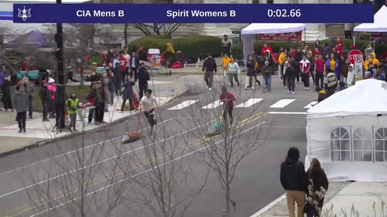
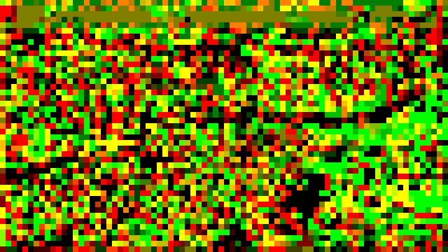
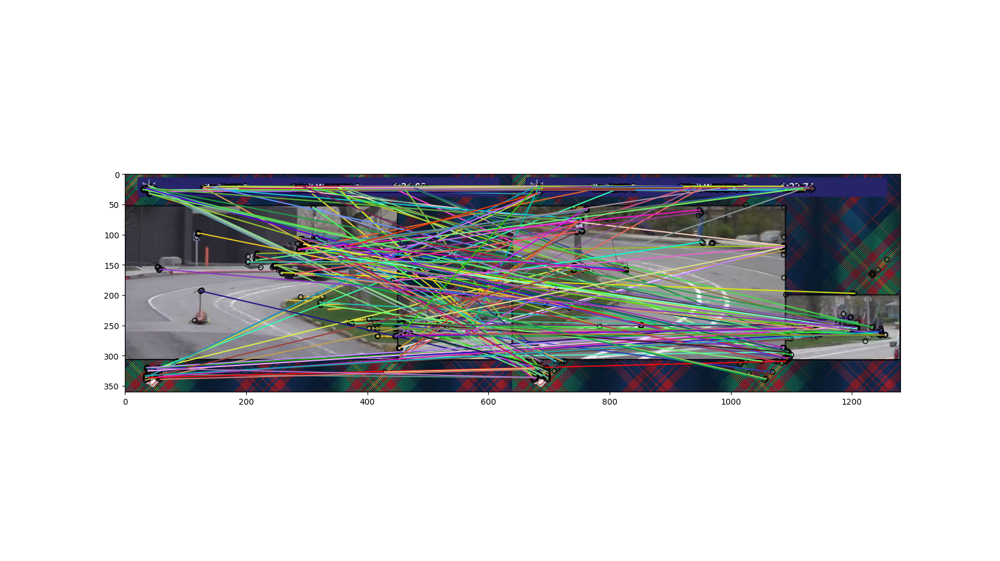
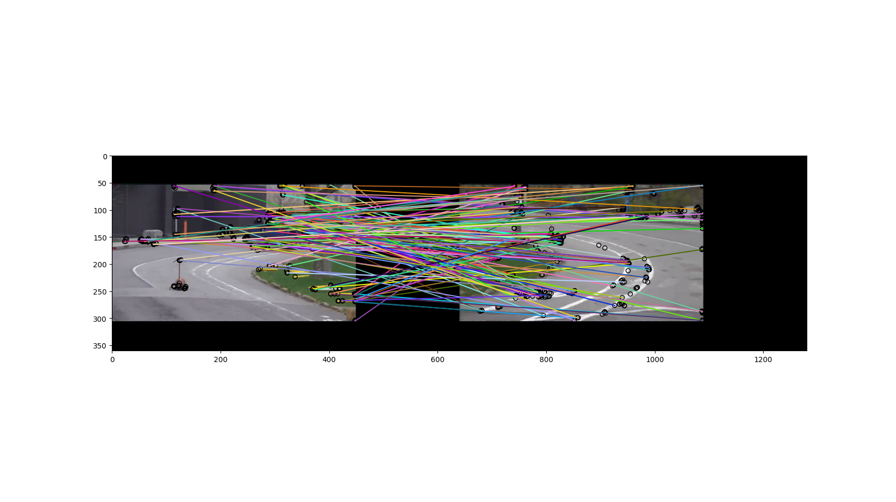

# Motivation

There is race footage (https://www.youtube.com/@CMUbuggy) that we would like to analyze.
It has pans and zooms within shots and cuts between different camera angles. We intend to extract both
3-D (course environment) and 4-D (racer progress) data.
The same techniques that will work on this example are broadly applicable to geolocation and
object tracking more generally. There is significant amounts of labeled video footage available in this
case.

The course looks like this:

Details in the [project proposal](Resources/Project_Proposal.pdf)

# Challenges

The main challenges were isolating the relevant parts of the videos and frames. Methods expected to work in theory did not work in practice.

Many attempts almost worked or worked on most frames but not all. The edge case failures were detected via manual review, which took significant time.
For a specfic example, automatic sub-picture boundary detection worked most of the time, but occasionally erroneously detected phantom small main pictures. In the masking pipeline, this creates sudden largely black frames in the middle of a sequence for no clear reason.

These preprocessing and masking tasks absorbed most of the effort, after including the false starts and dead ends.

## Motion detection example

Optical flow does not work well in this case.

## Timer extraction example

Frame level functions extract the timer and digits (to make sure timer is running).

Once implemented, this was effective at identifying the main race parts of the video (timer exists and is running).

## Overlay elements dominate feature detection

Without masking the overlay: 

Masking the overlay: 

# Results

Please see [Final Presentation](Resources/CS_766_Final_Presentation_Slides.pdf)

The code is available [here](Code/).
